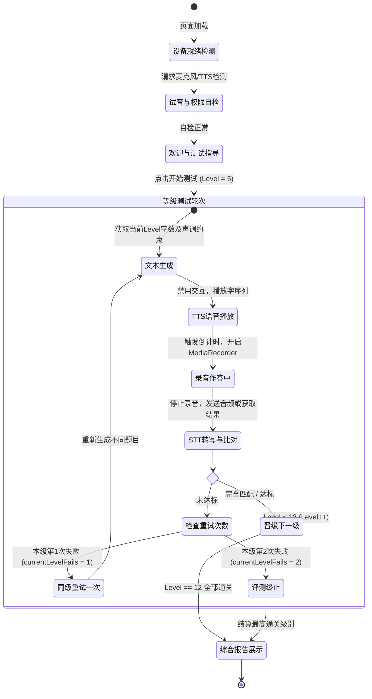
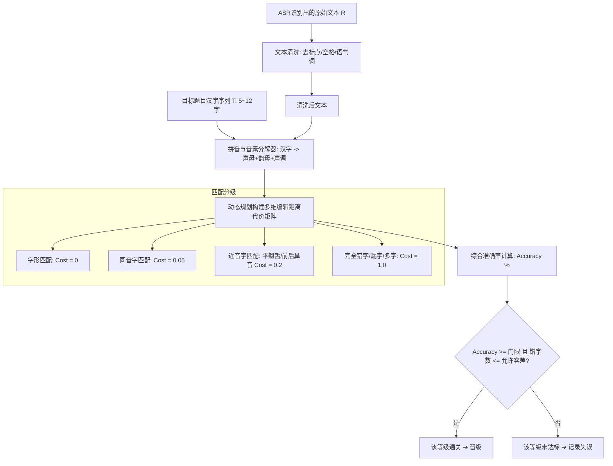
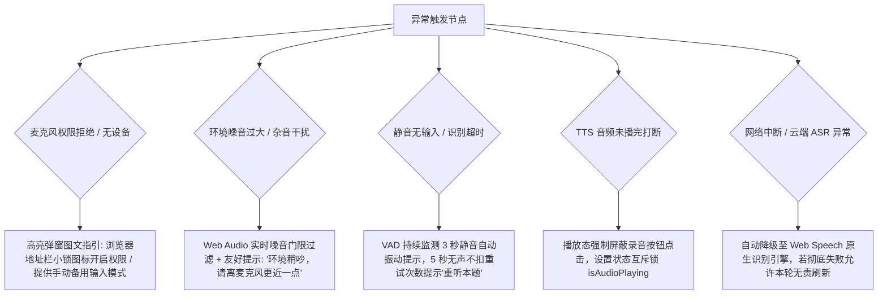

# 网页端听觉专注力测试系统技术实现方案与核心模块设计文档

> **版本**：v1.0.0  
> **面向场景**：K12 认知心理学/注意力训练系统（听觉工作记忆与广度测试）  
> **集成目标**：本模块采用与现有《视觉专注力测试》（Duolingo 交互风格与状态机）同构的设计，预留统一的数据通信总线与综合报告接口，便于后续合并为“视觉+听觉双模态注意力测评中枢”。

---

## 一、 系统全景与状态机设计 (System Architecture & FSM)

### 1.1 听觉专注力测试核心机制
听觉广度与听觉工作记忆（Auditory Working Memory Span）评测逻辑基于经典数字广度/词语广度实验范式：
- **测试等级**：第 5 级（5 个字）至第 12 级（12 个字），阶梯递进。
- **作答规则**：
  1. 系统播放无关联汉字序列（单字清晰朗读，字间固定间歇）。
  2. 播放结束后进入录音作答状态，用户口播复述。
  3. 识别并打分：
     - **全对/达标**：晋级下一难度等级（例如 Level 5 通过，进入 Level 6）。
     - **未达标（首次）**：记录当前级别失误 1 次，触发“同级别换题重试”。
     - **连续两次未达标**：当前级别测试终止，立即进入结果结算，生成 5~12 级测试报告。
  4. 最终评级为用户**稳定通过的最高等级**（若在第 8 级失败两次，则最终听觉专注力认证等级为第 7 级）。



---

## 二、 文本生成逻辑算法 (Text Generation Algorithm)

听觉注意力测试要求被测者仅依靠**纯粹的声音知觉与听觉工作记忆暂存**，严禁让被测者利用“语义联想”或“语块（Chunking）记忆效应”走捷径。因此，待测汉字序列生成必须满足四大核心约束：
1. **常用字约束**：严格限定在《现代汉语常用字表》（或教育部 K12 常用 2500 字）中，杜绝生僻字带来的认知识别阻碍。
2. **语义联想过滤**：绝对禁止两字、三字连成常用词汇、成语或熟语（如“天、空”、“苹、果”、“计、算、机”）。
3. **声调均衡分布**：普通话一二三四声（阴平 55、阳平 35、上声 214、去声 51）在单题中尽可能均等分布，且**严禁出现连续 3 个相同声调**（防止音调疲劳或音律记忆锚点）。
4. **字音唯一性**：单题内部不得出现重复汉字，且不得出现同音字（避免给听辨和 STT 比对造成歧义）。

### 2.1 词库元数据结构
```json
[
  { "char": "东", "pinyin": "dong", "tone": 1, "freqRank": 120 },
  { "char": "明", "pinyin": "ming", "tone": 2, "freqRank": 88 },
  { "char": "海", "pinyin": "hai", "tone": 3, "freqRank": 145 },
  { "char": "木", "pinyin": "mu", "tone": 4, "freqRank": 310 }
]
```

### 2.2 生成算法流程与伪代码实现

```typescript
interface CharItem {
  char: string;
  pinyin: string; // 不含声调的拼音
  tone: 1 | 2 | 3 | 4; // 声调：1-阴平, 2-阳平, 3-上声, 4-去声
  freqRank: number;
}

class AuditorySequenceGenerator {
  private candidatePool: CharItem[];
  private nGramBlacklist: Set<string>; // 包含双字词、三字词、成语词典的前缀树或哈希表

  constructor(charPool: CharItem[], blacklistWords: string[]) {
    this.candidatePool = charPool;
    this.nGramBlacklist = new Set(blacklistWords);
  }

  /**
   * 生成指定长度的测试序列
   * @param length 字数 (5 - 12)
   * @param maxAttempts 最大回溯重试次数
   */
  public generate(length: number, maxAttempts = 100): CharItem[] {
    for (let attempt = 0; attempt < maxAttempts; attempt++) {
      const sequence: CharItem[] = [];
      const toneCount = { 1: 0, 2: 0, 3: 0, 4: 0 };
      const usedChars = new Set<string>();
      const usedPinyins = new Set<string>();

      let success = true;

      for (let i = 0; i < length; i++) {
        // 1. 过滤候选集：去重、去同音字、声调防连
        const validCandidates = this.candidatePool.filter(item => {
          if (usedChars.has(item.char)) return false;
          if (usedPinyins.has(item.pinyin)) return false;

          // 防连续3个相同声调
          if (i >= 2) {
            const t1 = sequence[i - 1].tone;
            const t2 = sequence[i - 2].tone;
            if (t1 === t2 && item.tone === t1) return false;
          }

          // 保持声调均衡：单个声调数量不超过 Math.ceil(length / 4) + 1
          const maxAllowedForTone = Math.ceil(length / 4) + 1;
          if (toneCount[item.tone] >= maxAllowedForTone) return false;

          // 语义联想检测：与前一个字、前两个字不能组成黑名单词汇
          if (i >= 1) {
            const bigram = sequence[i - 1].char + item.char;
            if (this.nGramBlacklist.has(bigram)) return false;
          }
          if (i >= 2) {
            const trigram = sequence[i - 2].char + sequence[i - 1].char + item.char;
            if (this.nGramBlacklist.has(trigram)) return false;
          }

          return true;
        });

        if (validCandidates.length === 0) {
          success = false;
          break; // 当前分支死胡同，重新生成整题
        }

        // 随机抽取一个符合条件的字
        const selected = validCandidates[Math.floor(Math.random() * validCandidates.length)];
        sequence.push(selected);
        usedChars.add(selected.char);
        usedPinyins.add(selected.pinyin);
        toneCount[selected.tone]++;
      }

      if (success) {
        return sequence;
      }
    }
    throw new Error(`无法在 ${maxAttempts} 次尝试内生成满足约束的 ${length} 字测试序列`);
  }
}
```

---

## 三、 TTS 语音合成配置与调度策略 (TTS Audio Engine)

对于汉字听觉广度测试，合成语音的**发音独立性**与**节奏严谨性**至关重要。若直接朗读一整串字，TTS 引擎会自动产生连读变调（如连续两个上声字变阳平）或语义语气起伏，破坏测试信度。

### 3.1 核心音频声学参数方案
| 参数项 | 标准设定值 | 临床/心理学设计考量 |
| :--- | :--- | :--- |
| **朗读语速 (Rate)** | 1.0 字/秒（即 60 WPM） | 标准听觉广度测试国际范式：每秒 1 个音节，给予感知系统标准采样时间 |
| **音高 (Pitch)** | 1.0 (中性，基频约 180~220Hz) | 避免音调过尖锐或过低沉，采用沉稳亲和的青年播音员音色（如女中音/男中音） |
| **字间停顿 (Pause)** | 350ms ~ 400ms | 阻断音联与连读变调，保证每一个字独立进入听觉缓存器，不发生声学掩蔽 |
| **音量 (Volume)** | 1.0 (100%) | 响度恒定，避免前强后弱 |

### 3.2 双模 TTS 驱动架构方案

```mermaid
graph TD
    A[测试题目序列: [字1, 字2, ..., 字N]] --> B{TTS 引擎选型配置}
    B -->|高保真方案 (优先)| C[云端 TTS API + SSML 控制]
    B -->|轻量离线方案 (兜底)| D[前端 Web Speech API 队列驱动]

    subgraph 云端 TTS
    C --> C1[构建 SSML 标注文本<break time='350ms'/>]
    C1 --> C2[调用云端接口返回 MP3/WAV AudioBuffer]
    C2 --> C3[Web Audio API 解码 & 均匀播放]
    end

    subgraph 前端原生
    D --> D1[拆解为单字 Utterance 数组]
    D1 --> D2[基于 Promise + onend 调度单字播放]
    D2 --> D3[单字播放完后 setTimeout(350ms) 播下一个]
    end
```

#### 方案 A：云端 TTS + SSML 精准音频流（高保真方案，推荐）
支持微软 Azure Speech、阿里云智能语音、腾讯云或火山引擎。使用 SSML（语音合成标记语言）精确定义字间物理静音：
```xml
<speak version="1.0" xmlns="http://www.w3.org/2001/10/synthesis" xml:lang="zh-CN">
    <voice name="zh-CN-XiaoxiaoNeural">
        <prosody rate="-10%" pitch="0%">
            东 <break time="350ms"/>
            明 <break time="350ms"/>
            海 <break time="350ms"/>
            木 <break time="350ms"/>
            水
        </prosody>
    </voice>
</speak>
```
*优势*：音色高度纯净自然，发音饱满，不同操作系统、移动端与 PC 端音质 100% 保持一致。

#### 方案 B：纯前端 Web Speech API 异步队列调度（零成本兜底方案）
部分浏览器对 SSML 支持较弱，且若直接把一串字给 `SpeechSynthesisUtterance`，字间停顿无法微秒级精准控制。因此，必须采用**单字离散队列调度器**：
```javascript
class BrowserTTSQueuePlayer {
  constructor(charPauseMs = 380) {
    this.charPauseMs = charPauseMs;
    this.synth = window.speechSynthesis;
    this.isPlaying = false;
  }

  playSingleChar(char, voice) {
    return new Promise((resolve, reject) => {
      const utter = new SpeechSynthesisUtterance(char);
      utter.lang = 'zh-CN';
      utter.rate = 0.9;
      utter.pitch = 1.0;
      if (voice) utter.voice = voice;
      
      utter.onend = () => resolve();
      utter.onerror = (e) => reject(e);
      this.synth.speak(utter);
    });
  }

  async playSequence(charList, onProgress, onComplete) {
    this.isPlaying = true;
    // 取消之前可能未完成的朗读
    this.synth.cancel();

    // 优先选取普通话优质 Voice
    const voices = this.synth.getVoices();
    const zhVoice = voices.find(v => v.lang === 'zh-CN' && (v.name.includes('Natural') || v.name.includes('Neural') || v.name.includes('Google') || v.name.includes('Xiaoxiao'))) 
                 || voices.find(v => v.lang.startsWith('zh'));

    for (let idx = 0; idx < charList.length; idx++) {
      if (!this.isPlaying) break; // 中途终止
      if (onProgress) onProgress(idx, charList[idx]);
      
      await this.playSingleChar(charList[idx], zhVoice);
      
      // 最后一个字播放完无需等待停顿
      if (idx < charList.length - 1) {
        await new Promise(r => setTimeout(r, this.charPauseMs));
      }
    }

    this.isPlaying = false;
    if (onComplete) onComplete();
  }

  stop() {
    this.isPlaying = false;
    if (this.synth) this.synth.cancel();
  }
}
```

---

## 四、 语音录制、识别与智能打分引擎 (ASR & Scoring Engine)

### 4.1 麦克风录音链路设计 (MediaRecorder + Web Audio API)
1. **音频流约束配置**：
   ```javascript
   const stream = await navigator.mediaDevices.getUserMedia({
     audio: {
       channelCount: 1, // 单声道，减少数据体积并利于 ASR 识别
       sampleRate: 16000, // 语音识别黄金采样率
       sampleSize: 16,
       echoCancellation: true, // 回音消除（防止扬声器残余声音回流）
       noiseSuppression: true, // 降噪（消除电脑风扇、环境空调白噪音）
       autoGainControl: true   // 自动增益（适配不同学生与麦克风距离）
     }
   });
   ```
2. **实时静音检测 (VAD - Voice Activity Detection)**：
   借助 `AudioContext` 与 `AnalyserNode` 计算频域/时域能量有效值（RMS）。录音期间若连续 3 秒均处于静音门限以下，提示用户“未检测到声音，请大声作答”；若超过指定时限（如每字 2.5 秒基准 + 3 秒缓冲），自动停止录音触发打分。

### 4.2 语音转文字 (STT/ASR) 策略
对于听觉测试场景，无实际语义的“汉字列表口播”对 ASR 是极大考验（ASR 的语言模型往往倾向于按词组或整句自动修正）。
- **优化方案**：
  - 若使用云端 ASR（如百度、阿里、Whisper、腾讯），开启**热词词表（Hotwords/Vocabulary）**配置，注入当前题目汉字拼音与汉字，并将声学语言模型偏置设为“短语/单字识别模式”，关闭逆文本正则化（ITN）与强行语法自动纠正。
  - 若使用浏览器原生 `webkitSpeechRecognition`，设置 `continuous = true`，`interimResults = false`，`maxAlternatives = 3`（获取备选结果以备模糊比对）。

### 4.3 核心打分引擎：三维声韵矩阵与多级模糊比对算法

在实际测试中，学生复述完全准确，但由于口音轻微失真、环境微噪或 ASR 本身字典策略，**ASR 极易将原字写成同音字或近音字**（如原题是“木、风”，识别结果是“目、丰”；或者学生读了“东”，ASR 输出了“冬”）。若单纯使用严格的字符串全等比对，将产生严重的“伪判错”，损伤测试有效性。

为此，系统构建**三层加权打分模型**：
1. **字形完全命中 (Exact Char Match)**：字序与汉字完全一致。
2. **拼音与声调同音命中 (Homophone Match)**：汉字不同，但普通话拼音与声调完全一致（视作 100% 正确复述，消除 ASR 同音异字误差）。
3. **近音容差与声母韵母距离 (Fuzzy Phonetic Edit Distance)**：平翘舌（z/zh, c/ch, s/sh）、前后鼻音（en/eng, in/ing）轻微失真的加权惩罚判定。



#### 打分核心算法实现代码
```typescript
import { pinyin } from 'pinyin-pro'; // 或轻量拼音库

interface PhoneticToken {
  rawChar: string;
  pinyinFull: string;   // 例: "dong1"
  tone: number;         // 1, 2, 3, 4, 0
  initial: string;      // 声母: "d"
  final: string;        // 韵母: "ong"
}

interface MatchResult {
  isPass: boolean;
  score: number;        // 0 - 100 准确率
  hits: number;         // 命中有效字数
  details: Array<{
    targetChar: string;
    actualChar: string | null;
    status: 'EXACT' | 'HOMOPHONE' | 'FUZZY' | 'WRONG' | 'MISSING';
    confidence: number;
  }>;
}

export class AuditoryScoringEngine {
  /**
   * 将汉字序列拆解为音素结构
   */
  private static parseToPhonetic(text: string): PhoneticToken[] {
    const chars = text.replace(/[^\u4e00-\u9fa5]/g, '').split('');
    return chars.map(char => {
      const p = pinyin(char, { toneType: 'num', type: 'all' })[0];
      return {
        rawChar: char,
        pinyinFull: p.pinyin,
        tone: Number(p.num) || 0,
        initial: p.initial || '',
        final: p.final || ''
      };
    });
  }

  /**
   * 计算单个字与被识别字的置信度代价 (0: 完美吻合, 1: 完全不匹配)
   */
  private static calculateCharDistance(t: PhoneticToken, a: PhoneticToken): number {
    // 1. 字形完全相等
    if (t.rawChar === a.rawChar) return 0;

    // 2. 拼音及声调完全一致 (同音字 ASR 偏差，在听觉测试中视为用户完全说对)
    if (t.pinyinFull === a.pinyinFull) return 0.05;

    // 3. 拼音相同但声调轻微被系统误判 (如二声/三声轻微模糊)
    if (t.initial === a.initial && t.final === a.final) return 0.15;

    // 4. 近音字/方言口音容差 (平翘舌、前后鼻音)
    const isSimilarInitial = (
      (t.initial === 'z' && a.initial === 'zh') || (t.initial === 'zh' && a.initial === 'z') ||
      (t.initial === 'c' && a.initial === 'ch') || (t.initial === 'ch' && a.initial === 'c') ||
      (t.initial === 's' && a.initial === 'sh') || (t.initial === 'sh' && a.initial === 's') ||
      (t.initial === 'l' && a.initial === 'n')  || (t.initial === 'n' && a.initial === 'l')
    );

    const isSimilarFinal = (
      (t.final === 'an' && a.final === 'ang') || (t.final === 'ang' && a.final === 'an') ||
      (t.final === 'en' && a.final === 'eng') || (t.final === 'eng' && a.final === 'en') ||
      (t.final === 'in' && a.final === 'ing') || (t.final === 'ing' && a.final === 'in')
    );

    if (isSimilarInitial && t.final === a.final) return 0.25;
    if (t.initial === a.initial && isSimilarFinal) return 0.25;

    // 5. 其余视为完全不同
    return 1.0;
  }

  /**
   * 采用带权 Levenshtein 动态规划，比对目标字列与识别字列
   */
  public static evaluate(targetText: string, recognizedText: string): MatchResult {
    const target = this.parseToPhonetic(targetText);
    const actual = this.parseToPhonetic(recognizedText);

    const m = target.length;
    const n = actual.length;

    // dp[i][j] 表示 target 前 i 个字与 actual 前 j 个字的最小匹配代价值
    const dp: number[][] = Array.from({ length: m + 1 }, () => Array(n + 1).fill(0));

    for (let i = 0; i <= m; i++) dp[i][0] = i;
    for (let j = 0; j <= n; j++) dp[0][j] = j;

    for (let i = 1; i <= m; i++) {
      for (let j = 1; j <= n; j++) {
        const cost = this.calculateCharDistance(target[i - 1], actual[j - 1]);
        dp[i][j] = Math.min(
          dp[i - 1][j] + 1,       // 漏读
          dp[i][j - 1] + 1,       // 误读多读
          dp[i - 1][j - 1] + cost // 替换或匹配
        );
      }
    }

    const totalDistance = dp[m][n];
    // 归一化得分 (0 ~ 100)
    const rawScore = Math.max(0, 1 - totalDistance / m) * 100;
    const finalScore = Math.round(rawScore);

    // 听觉注意力通过判定标准：
    // 当字数 5~8 时，要求严格匹配 (允许 ASR 同音字置换，总代价值 <= 0.35)
    // 当字数 9~12 时，高负荷记忆下，代价值 <= 0.85 (允许最多 1 个近音字轻微失真)
    const thresholdCost = m <= 8 ? 0.35 : 0.85;
    const isPass = totalDistance <= thresholdCost;

    return {
      isPass,
      score: finalScore,
      hits: Math.max(0, m - Math.round(totalDistance)),
      details: [] // 可回溯具体哪个位置读错
    };
  }
}
```

---

## 五、 异常处理与系统级容错机制 (Resilience & Edge Cases)

在实际 K12 学校或家庭浏览器环境中，硬件与网络情况复杂，必须设立完备的异常捕获与友好恢复路径：



### 5.1 异常场景清单与应对方案设计

| 异常类型 | 触发判定 | 前端捕获与阻断机制 | 用户端 UI 引导策略 |
| :--- | :--- | :--- | :--- |
| **麦克风权限拒绝** | `NotAllowedError` 或 `navigator.permissions` 状态为 `denied` | 阻断“开始测试”入口，不可强行推进状态机。 | 弹出专属图解弹窗：分步骤演示 Chrome / Edge / Safari 如何点击地址栏“锁”图标开启麦克风。 |
| **缺少音频输入硬件** | `NotFoundError` 或 `DevicesNotFoundError` | 初始化自检阶段阻断。 | 提示“未检测到麦克风设备，请插入耳机或麦克风后刷新页面”。提供备选的“键盘复述对照模式（兜底备用）”。 |
| **环境严重噪音/风噪** | 连续音频帧的 RMS 底噪 > -30dBFS | 在录音前置“环境噪音自检”阶段检测，录音时启用动态双重高通滤波（`BiquadFilterNode` 80Hz 滤波）。 | 弹出黄色小气泡提醒：“检测到环境背景音较吵，建议佩戴耳机获得最佳测试准确率”。 |
| **学生走神/未发声** | 开启录音后 VAD 检测能量连续低于门限超过 4 秒 | `MediaRecorder` 录音未达到能量阈值，不生成有效音频数据。 | 提示：“刚才没听清你的声音，请大声复述一遍哦！”**不计入失败重试惩罚**，允许重新播放本轮读音 1 次。 |
| **录音超时未提交** | 录音时间超过公式：`字数 * 2.5s + 3s` | 定时器强制触发 `mediaRecorder.stop()` 并自动交卷。 | 倒计时环形进度条渐变红色，最后 3 秒伴随轻微提示音并自动识别结算。 |
| **抢答与音频重叠** | 用户在系统仍在播放字音时过早发声 | 互斥锁 `isSystemPlaying = true`。系统播放完毕前，录音控件显示锁定遮罩与“请仔细听...”动画。 | 播放完毕后发出轻快的“叮~”（Prompt Sound），麦克风动效泛起波纹，引导被测者开始复述。 |
| **识别服务网络异常** | 云端 ASR API 超时 (5000ms) 或网络离线 | `fetch` 抛出 `AbortError`，自动无缝回退至本地 `webkitSpeechRecognition` 兜底。 | 若仍不可用，提示“网络波动，请检查网络”，保持当前题目状态，允许重新作答本轮。 |

---

## 六、 与《视觉专注力测试》系统的一体化合并架构设计 (Future Integration)

为了与现有的单文件应用 `视觉专注力测试.html` 无缝合并，我们设计了一致的架构蓝图：

### 6.1 统一 UI 与设计规范 (Duolingo 风格继承)
- **配色系统**：复用原有色盘（`--duo-green`, `--duo-blue`, `--duo-yellow`, `--duo-red` 以及 3D 立体拟物阴影按钮 `border-bottom: 4px solid`）。
- **生命周期布局**：
  1. Header：共享姓名、学校输入栏，增加【测试模式切换】Tab（“视觉专注力” vs “听觉专注力” vs “双模态全套测评”）。
  2. 关卡状态栏：复用统一的等级指示器、耗时统计与失误重试状态指示。
  3. 报告页面：合并为“综合认知注意力报告”，分别展示视觉广度分（5~10/12 分）、听觉广度分（5~12 分）以及雷达图双维度对比。

### 6.2 模块化代码合并拓扑

```
┌────────────────────────────────────────────────────────────────────────┐
│                        index.html (综合专注力评测系统)                     │
├────────────────────────────────────────────────────────────────────────┤
│ 1. 共享基础层 (Shared Core)                                              │
│    ├── LocalStorage 榜单持久化 (Leaderboard Storage)                     │
│    ├── 考生元数据管理 (Player Meta & Session State)                       │
│    └── 统一音效与动画系统 (Sound Effects / Micro-animations)              │
├──────────────────────────────────┬─────────────────────────────────────┤
│ 2. 视觉专注力模块 (Visual Module)  │ 3. 听觉专注力模块 (Auditory Module)    │
│    ├── 9x9 字符网格渲染器         │    ├── 汉字生词平衡生成器 (NLP Alg) │
│    ├── 视线记忆计时器             │    ├── TTS 离散定时朗读引擎 (Queue)   │
│    ├── 算术干扰题逻辑             │    ├── 麦克风录音与 VAD 能量检测      │
│    └── 复原勾选与点阵核对         │    └── ASR 转写与拼音相似度打分引擎   │
├──────────────────────────────────┴─────────────────────────────────────┤
│ 4. 综合认知测评报告 (Unified Multi-modal Cognitive Report)               │
│    ├── 视觉专注力得分 (Visual Working Memory Span: 5-12级)               │
│    ├── 听觉专注力得分 (Auditory Working Memory Span: 5-12级)             │
│    ├── 认知偏向分析 (视觉敏锐型 vs 听觉敏锐型 vs 均衡型)                 │
│    └── 打印与 PDF / 长图导出能力                                        │
└────────────────────────────────────────────────────────────────────────┘
```

### 6.3 统一数据模型规范 (Unified Assessment Result Schema)
```typescript
interface UnifiedAssessmentResult {
  studentId: string;
  studentName: string;
  school: string;
  timestamp: number;
  
  // 视觉专注力成绩
  visualTest: {
    finalLevel: number;        // 5 - 12 级
    accuracy: number;          // 平均准确率 %
    totalDurationSec: number;  // 耗时
    levelLogs: Array<{
      level: number;
      duration: number;
      accuracy: number;
      retryCount: number;
    }>;
  };

  // 听觉专注力成绩
  auditoryTest: {
    finalLevel: number;        // 5 - 12 级
    accuracy: number;          // 平均复述相似度 %
    totalDurationSec: number;  // 耗时
    levelLogs: Array<{
      level: number;
      targetSequence: string;  // 播放的汉字序列，例: "水天木风明"
      recognizedText: string;  // ASR 转写结果
      score: number;
      passed: boolean;
      retryCount: number;
    }>;
  };

  // 综合认知画像评价
  cognitiveProfile: {
    dominantModal: 'VISUAL_DOMINANT' | 'AUDITORY_DOMINANT' | 'BALANCED';
    compositeScore: number;    // 综合注意力指数 (加权计算)
    recommendation: string;    // 个性化学习与训练建议
  };
}
```

---

## 七、 项目落地里程碑与验收标准

1. **第一阶段：核心算法与独立原型（可独立运行的听觉专注力页面）**
   - 接入 2500 常用字库与词典黑名单，实现 5~12 级动态文本生成。
   - 完成 Web Speech API / TTS 离散队列驱动，字间严格停顿 350ms。
   - 接入 MediaRecorder 录音与拼音编辑距离打分算法，完成单元测试覆盖。
2. **第二阶段：容错强化与交互打磨**
   - 接入 VAD 实时声波动画组件与静音兜底机制。
   - 实现“失误 1 次允许重试，失误 2 次自动终止”的状态机流转。
3. **第三阶段：视觉 + 听觉合并发布**
   - 合并至主单页文件，统一顶部导航与模式切换 Tab。
   - 输出支持打印与分享的双模态综合评测报告。
